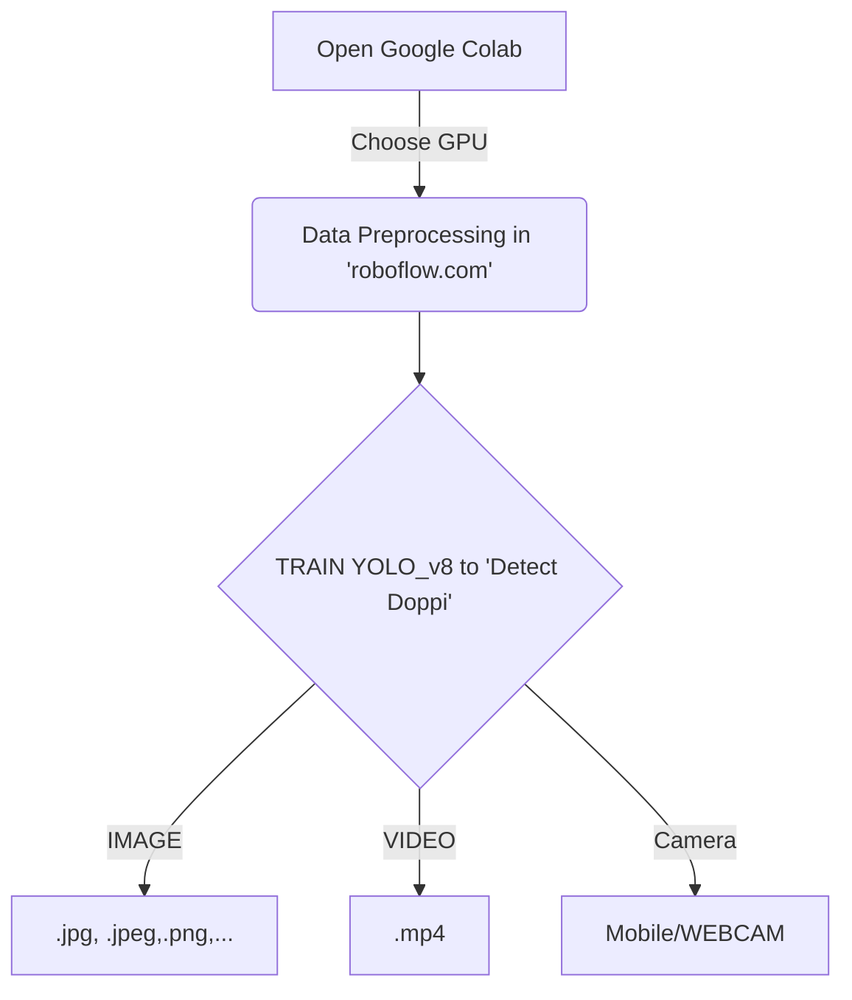

# Assalomu Aleykum, NEURONS ga Xush Kelibsiz !!!

Do'ppi Detection bu YOLO_v8, Google Colab va Roboflow tool laridan foydalanib O'zbekcha Do'ppini Detect qilishni o'rganuvchi CV (Computer Vision) project hisoblanadi. Quyida siz umumiy workflow(ishlash tartibini) ko'rishingiz mumkin.
 

# Natijalar : 

# Raxmat NEURONS ga Xush Kelibsiz !!!

### Yanada Koproq YOLO ni o'rganib chiqing : https://github.com/ultralytics/ultralytics

URINOV AZIZBEK | 18.01.2024 | K II CO. | Face Identification | South Korea

