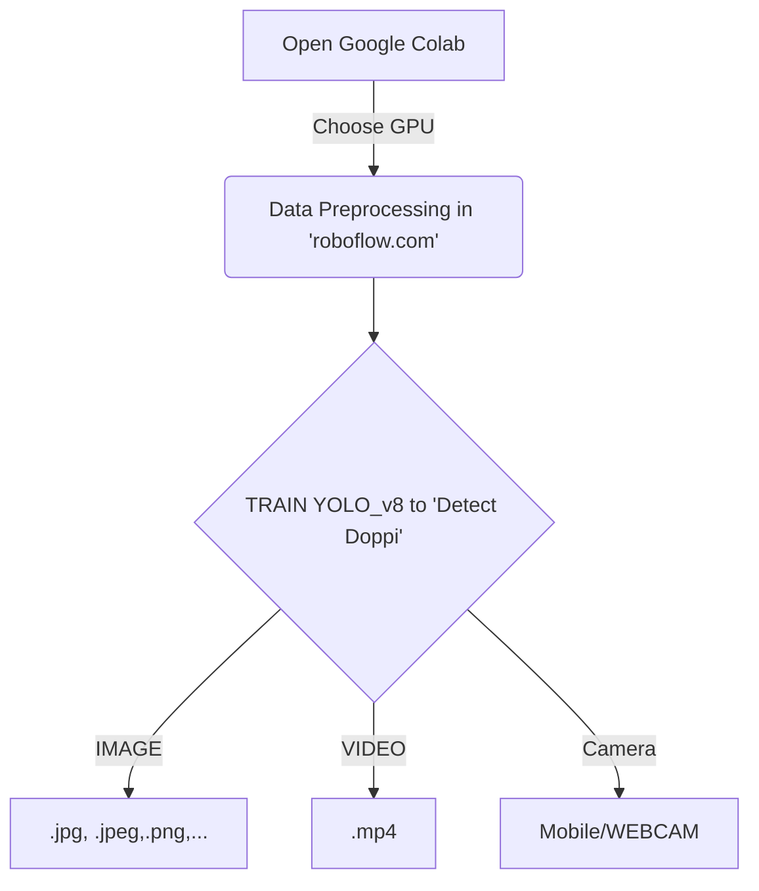

# Assalomu Aleykum, NEURONS ga Xush Kelibsiz !!!

Do'ppi Detection bu YOLO_v8, Google Colab va Roboflow tool laridan foydalanib O'zbekcha Do'ppini Detect qilishni o'rganuvchi CV (Computer Vision) project hisoblanadi. Quyida siz umumiy workflow(ishlash tartibini) ko'rishingiz mumkin.
 

# Natijalar : 

