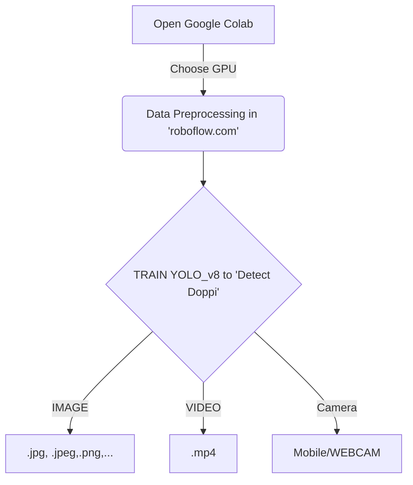

``` mermaid
        flowchart TD
            A[Open Google Colab] -->|Choose GPU| B(Data Preprocessing in 'roboflow.com')
            B --> C{TRAIN YOLO_v8 to 'Detect Doppi'}
            C -->|IMAGE| D[.jpg, .jpeg,.png,...]
            C -->|VIDEO| E[.mp4]
            C -->|Camera| F[Mobile/WEBCAM]
```
